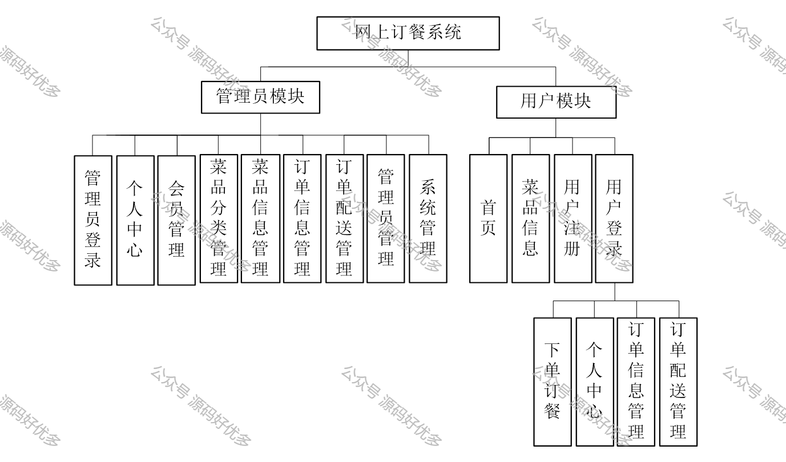
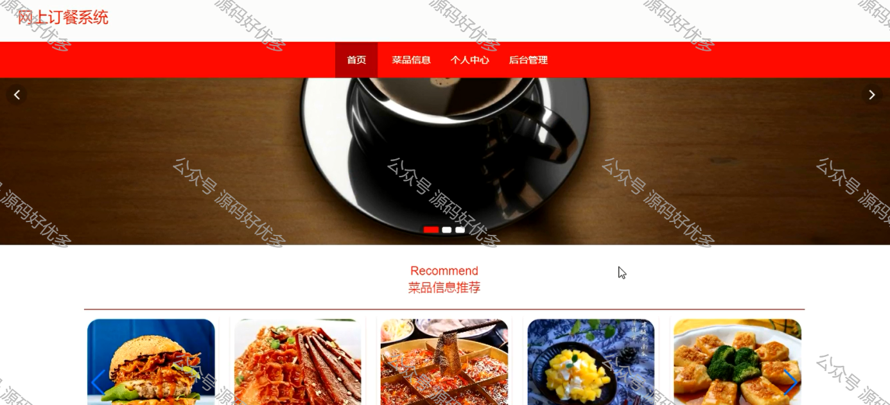
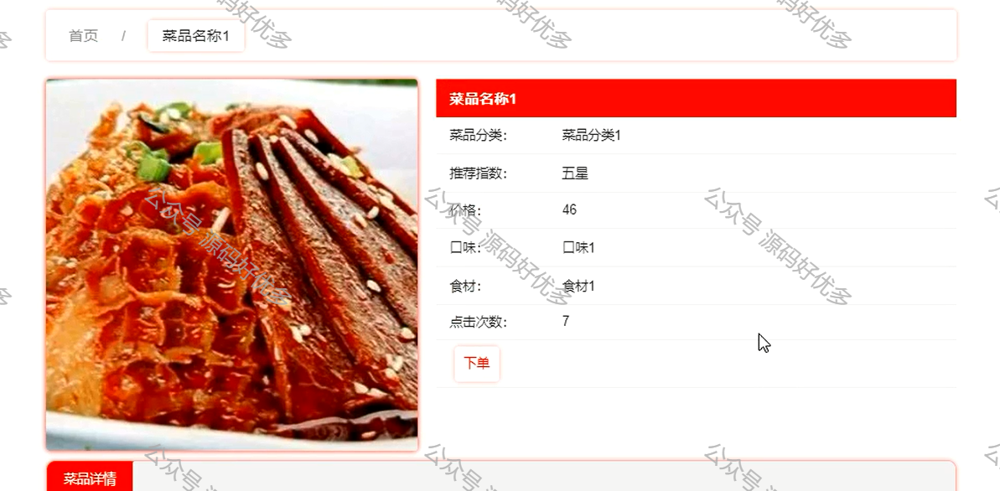
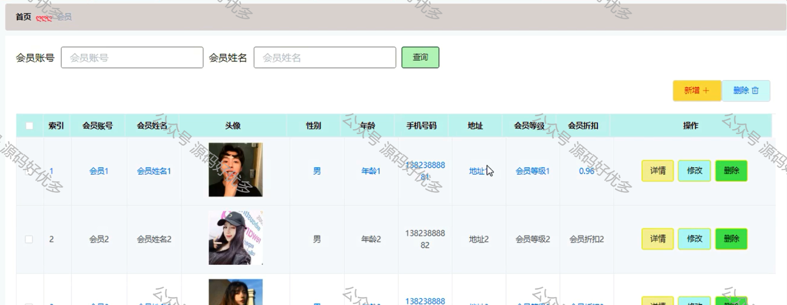
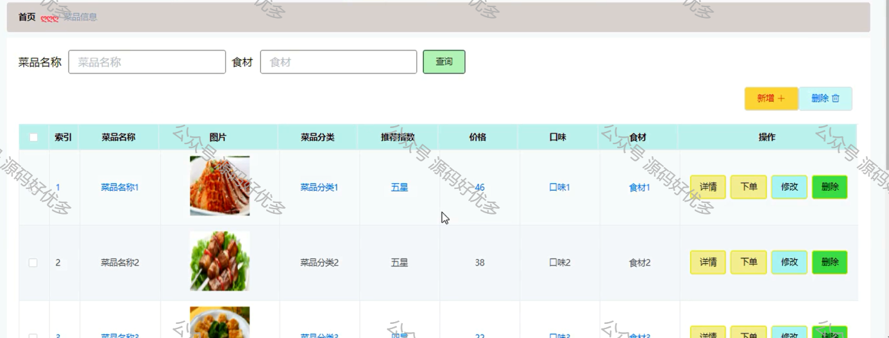
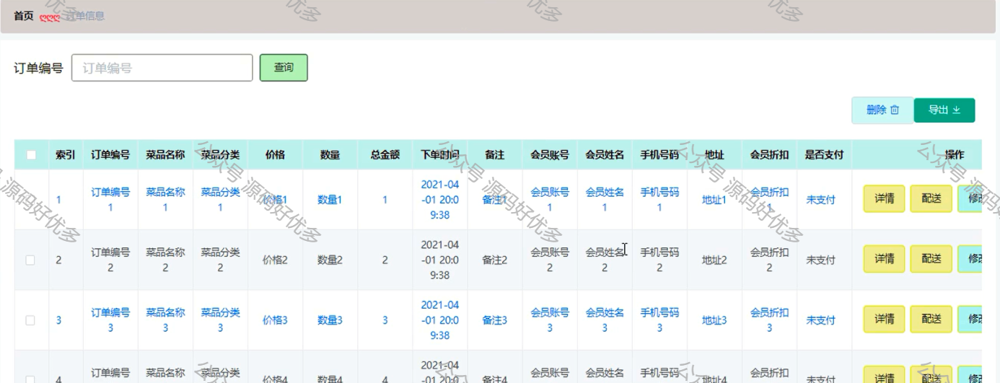

## 查看主页获取源码 

> **作者介绍**： **✌**全网粉丝10W+本平台特邀作者、博客专家、CSDN新星计划导师、java领域优质创作者,博客之星、掘金/华为云/阿里云/InfoQ等平台优质作者、专注于毕业项目实战 **✌**

  

### 一、作品包含

源码+数据库+设计文档万字LW+PPT+全套环境和工具资源+部署教程

### 二、项目技术

前端技术：Html、Css、Js、Vue、Element-ui

数据库：MySQL

后端技术：Java、Spring Boot、MyBatis

  

### 三、运行环境

开发工具：IDEA/eclipse

数据库：MySQL8.0

数据库管理工具：Navicat10以上版本

环境配置软件： JDK1.8+Maven3.6.3

前端Nodejs：14

  

### 四、项目介绍

项目编号：springboot006

随着我国经济的飞速发展，人们的生活速度明显加快，在餐厅吃饭排队的情况到处可见，近年来由于新兴IT行业的空前发展，它与传统餐饮行业也进行了新旧的结合，很多餐饮商户开始通过网络建设订餐系统，通过专门的网上订餐系统，一方面节省了用户订餐的时间，给用户带来方便，另一方面给商户带来了新的销售模式，同时也使订餐的管理规范化，系统化，给人们的生活带来了很大的便利。
本文重点阐述了网上订餐系统的开发过程，以实际运用为开发背景，基于Spring Boot框架，运用了JSP技术和MYSQL作为系统数据库进行开发，充分保证系统的安全性和稳定性。本系统界面良好，操作简单方便，通过系统概述、系统分析、系统设计、数据库设计、系统测试这几个部分，详细的说明了系统的开发过程，最后并对整个开发过程进行了总结，实现了用户通过网络进行订餐的重要功能。
本基于Spring Boot的网上订餐系统运行效果稳定，操作方便、快捷，界面友好，是一个功能全面、实用性好、安全性高，并具有良好的可扩展性、可维护性的订餐平台。

### 五、运行截图

  
